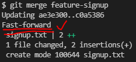

## pull

`git pull origin master` 

- origin(remote)의 master 브랜치를 땡기여잇
- push의 master는 로컬의 브랜치, pull의 master는 리모트의 브랜치

- vs code가 지원하는 기능, 직접 수정하자
- github 에서 파일 수정 가능하나 권장하지 않음

---

`git remote rm origin` 

`git clone (url) .` < (.)은 현재 위치를 표현, 하위항목으로 만들지 않음

---

## 취소하기

- add 취소하기: `git restore --staged {file}`
- Working Directory 변경사항 취소하기: `git restore {file}` / 주의: 다 날라감
- commit 되돌리기: `git reset --hard {commit_id}` / 옵션 다양함(`-soft`, `-mixed`), 사용 주의

***

## 원하지 않는 파일 제외하기

`.gitignore`

- `data.csv` : 특정 파일 제외
- `{folder_name}/` : 특정 폴더 제외
- `*.png` : 특정 확장자 제외
- `!profile.png` : 모든 png 제외, profile.png는 포함 / `*.png` 하고 난 후 이어서 작성

[git ignore helper](https://www.toptal.com/developers/gitignore)

---

# Shared Repository Model

Shared Repository Model은 동일한 저장소를 공유하여 활용하는 방식.

- 팀장 repository owner
- 팀원 collaborator

1. 팀장 팀원초대

2. 팀원 이메일 수락

   

---

# Branch

특정 커밋을 가리키는 ***포인터*** 

브랜치 자주 만들어라!

`git log --graph`

`git log --graph --oneline`

1. fast forword merge: 기존 마스터 브랜치에 변경사항 없어 단순히 앞으로 이동

2. merge commit case : 기존 마스터 브랜치에 변경사힝이 있어 병합 커밋 발생

   ​									fast forword 할 수 없음 = conflict 발생 = merge commit 발생

   ​									conflict 발생 안하더라도 fast forword 안되면 auto merge

- `git branch {branch name}` 브랜치 생성
- `git checkout {branch name}` 브랜치 이동
- `git checkout -b {branch name}` 생성 및 이동
- `git branch` 브랜치 목록
- `git branch -d {branch name}` 브랜치 삭제

master 브랜치는 **항상 동작**하는 코드만 두고, 추가기능 구현은 feature 브랜치로

## ` git merge {target branch name}`

---

# Git Flow 

branch 활용 전략

---

## pr

pull request

## fork

remote에서 remote로
